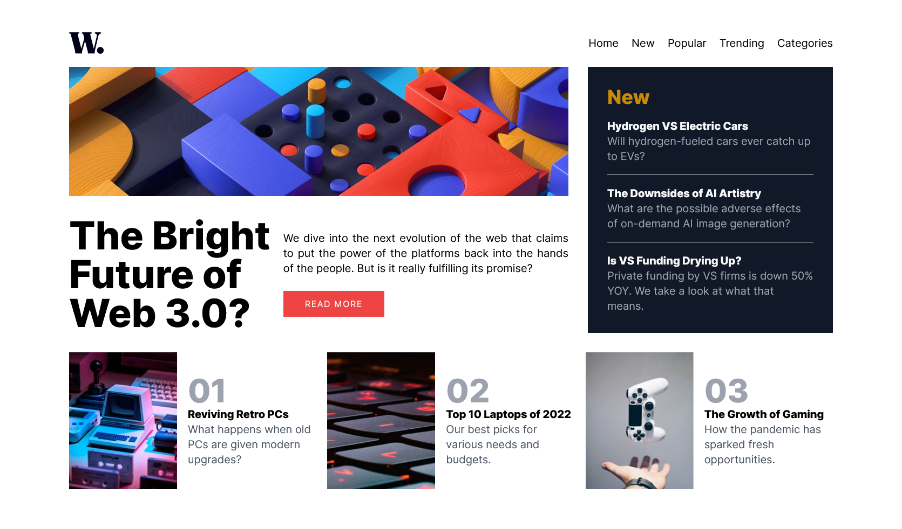
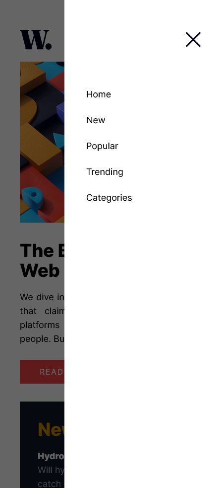

# Frontend Mentor - News homepage solution

This is a solution to the [News homepage challenge on Frontend Mentor](https://www.frontendmentor.io/challenges/news-homepage-H6SWTa1MFl). Frontend Mentor challenges help you improve your coding skills by building realistic projects. 

## Table of contents

- [Overview](#overview)
  - [The challenge](#the-challenge)
  - [Screenshot](#screenshot)
  - [Links](#links)
- [My process](#my-process)
  - [Built with](#built-with)
  - [What I learned](#what-i-learned)
  - [Continued development](#continued-development)
  - [Useful resources](#useful-resources)
- [Author](#author)

## Overview

### The challenge

Users should be able to:

- View the optimal layout for the interface depending on their device's screen size
- See hover and focus states for all interactive elements on the page

### Screenshot

### Links

- Solution URL: [Github Repository](https://github.com/angelikavalerio/news-homepage-vue)
- Live Site URL: [News Homepage](https://news-homepage-vue.vercel.app/)

## My process

### Built with

- HTML5 markup
- Tailwind CSS
- SCSS
- [Vue](https://vuejs.org/) - JS library

### What I learned

Learned how to configure Tailwind CSS, as well as, adding custom breakpoints and animations.

### Continued development

Need to work on improving setting of breakpoints in Tailwind and also figuring out an easy way to remove scrolling from the content behind whenever the navigation is open without relying on Javascript. 

### Useful resources

- [Tailwind CSS Documentation](https://v2.tailwindcss.com/docs) - Relied on this documentation to determine the associated class for a CSS property.

## Author

- Github - [Angelika Valerio](https://github.com/angelikavalerio)
- Frontend Mentor - [@angelikavalerio](https://www.frontendmentor.io/profile/angelikavalerio)

